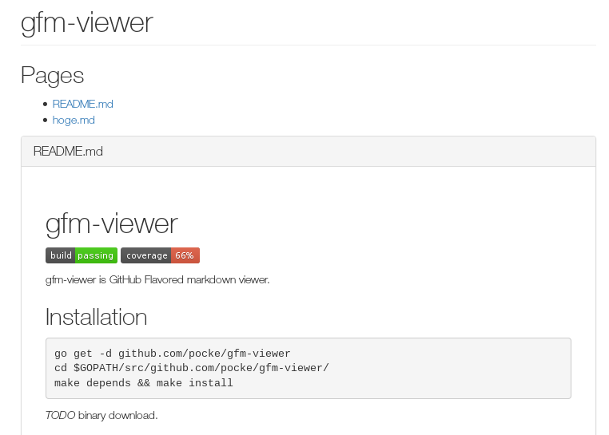

gfm-viewer
==============

[](https://travis-ci.org/pocke/gfm-viewer)
[](https://coveralls.io/r/pocke/gfm-viewer?branch=travis)

gfm-viewer is GitHub Flavored markdown viewer.


Installation
-----------------

```sh
go get -d github.com/pocke/gfm-viewer
cd $GOPATH/src/github.com/pocke/gfm-viewer/
make depends && make install
```

*TODO*  binary download.

Usage
----------

```sh
gfm-viewer FILENAME1 FILENAME2 ...
```

Automatically opens the browser.
Parsed markdown is opened by click filename.

If you save file, automatically parse and reload.


### Screen Shot




Supports
-----------

- Linux

Maybe, it works on other OS.
But I do not have OS other than Linux. So, I can't check of operation on other OS.

License
-------------

Copyright &copy; 2015 Masataka Kuwabara
Licensed [MIT][mit]
[MIT]: http://www.opensource.org/licenses/mit-license.php
